```{r setup, include=FALSE}
options(htmltools.dir.version = FALSE)
library(xaringanthemer)
extra_css <- list(
  ".red"   = list(color = "red"),
  ".small" = list("font-size" = "70%"),
  ".big" = list("font-size" = "120%"),
  ".full-width" = list(
    display = "flex",
    width   = "100%",
    flex    = "1 1 auto"
  )
)
```


class: center, middle, inverse

# Overview

---

# Overview

--

## What is reproducibility?

--

## Why is it important?

--

## How do we make research reproducible?

--

## Challenges and open questions

---


class: center, middle, inverse

# What is reproducibility?
Reproduction in demography is not just fertility 👶
---


# What is reproducibility?

--

- Research is **reproducible** if it can be reproduced exactly, given all the materials used in the study

--

    + Note that materials need to be provided!
--

    + For demographic research, 'materials' usually means data, code and software
--

    + Reproduce the data, methods and results (including figures, tables)
--

- Another person should be able to take the exact same data, run the exact same analysis, and produce the exact same results

--

- Different to **replicability**

--
    
    + carrying out a new study based on the description of the data and method provided in the original publication, and obtaining results that are similar enough.

---

# Increased awareness recently

'Replication crisis', starting in Psychology, now extended to other fields

--

- Famous results called into question (e.g. Marshmallow test, power poses, ego depletion)

--

- Issues range from weaker evidence than originally thought, to fabrication of data

--

- 2018 paper: 13 of 21 were replicated, but the effect sizes were often much smaller

```{r, echo = F, out.width='400', fig.align='center'}

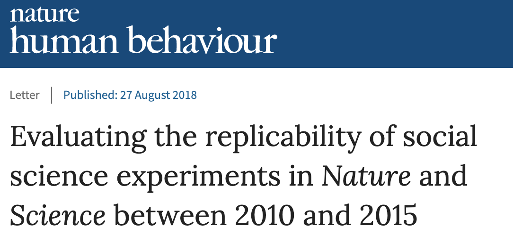

```

---

# Just one part of doing open science

```{r, echo = F, out.width='1000', fig.align='center'}

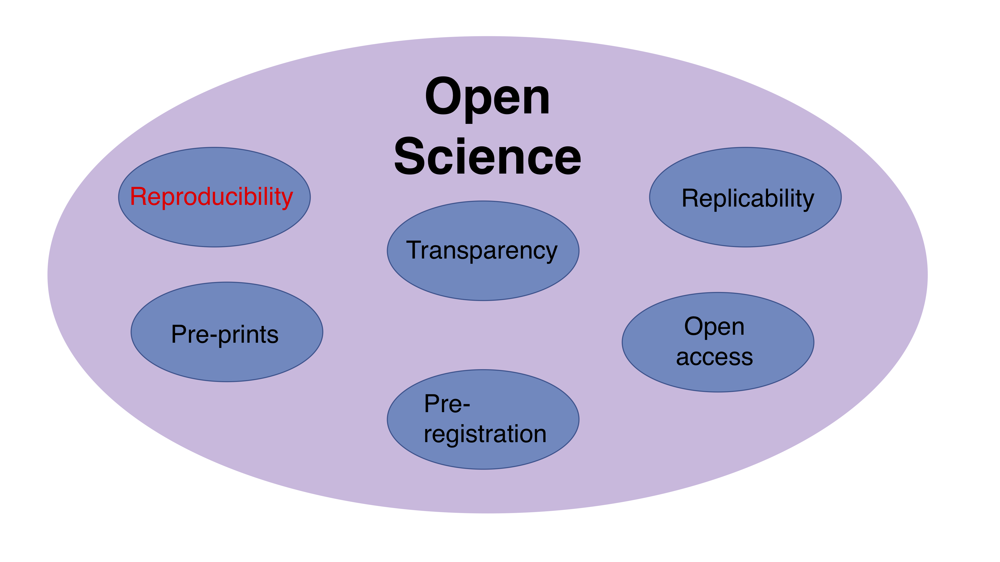

```


---


class: center, middle, inverse

# Why is reproducibility important?

---


class: center


background-image: url("https://media.giphy.com/media/26DOPCEoS8Ntc7suA/giphy.gif")
background-position: 50% 50%

# Reproducibility is important for science


---

# Important for science

Allows us to:

--

- Trust

--

- Understand 

--

- Validate

--

- Replicate

--

- Build on / extend

---

# Example: mortality in Puerto Rico after Hurricane Maria

- Category 5 hurricane hit Dominica, the U.S. Virgin Islands, and Puerto Rico in September 2017

- Initial official death toll in PR was 64

.pull-left[
```{r, echo = F, out.width='1000', fig.align='center'}

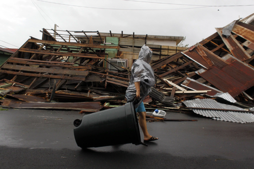

```
]

.pull-right[
```{r, echo = F, out.width='1000', fig.align='center'}

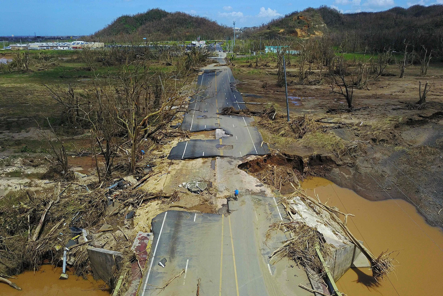

```
]


---

# Mortality in Puerto Rico after Hurricane Maria


- Team of researchers ran a survey to ascertain an independent estimate of mortality

--

- Paper published in [NEJM](https://www.nejm.org/doi/full/10.1056/NEJMsa1803972) gave post-hurricane estimate of 4645 excess deaths (95% confidence interval, 793 to 8498)

--

- Huge amount of press, and both praise and criticism from researchers

--

- The team published all materials (including raw data!) on [GitHub](https://github.com/c2-d2/pr_mort_official)

--

- This allowed other researchers to rerun their analysis with different assumptions

.pull-left[
```{r, echo = F, out.width='500', fig.align='center'}

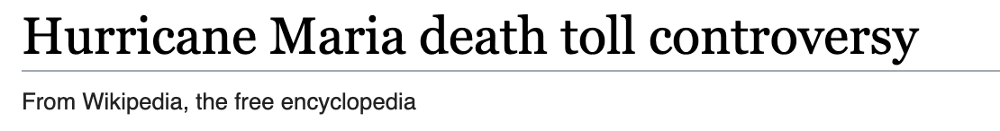

```
]


.pull-right[
```{r, echo = F, out.width='2000', fig.align='center'}

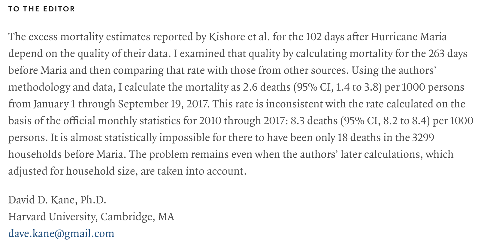

```
]
---

class: center, middle

# Reproducibility is important for policy-making

---

# Important for policy-making


- A lot of our work has policy implications. 

- Should be the goal for much of our research! To influence policy in order to improve lives. 

- Reproducibility helps us to evaluate the evidence for implementing new policies based on findings.  


```{r, echo = F, out.width='400', fig.align='center'}

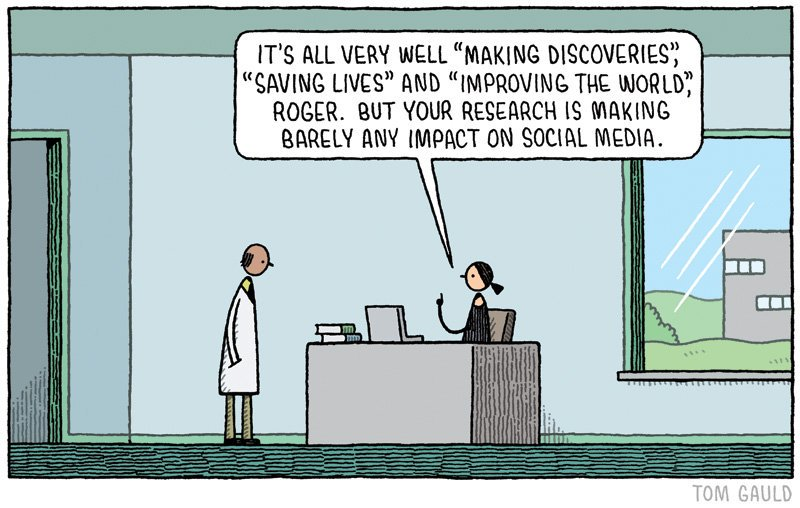

```


---

# Example: Early Intervention System (EIS)

```{r, echo = F, out.width='300', fig.align='center'}

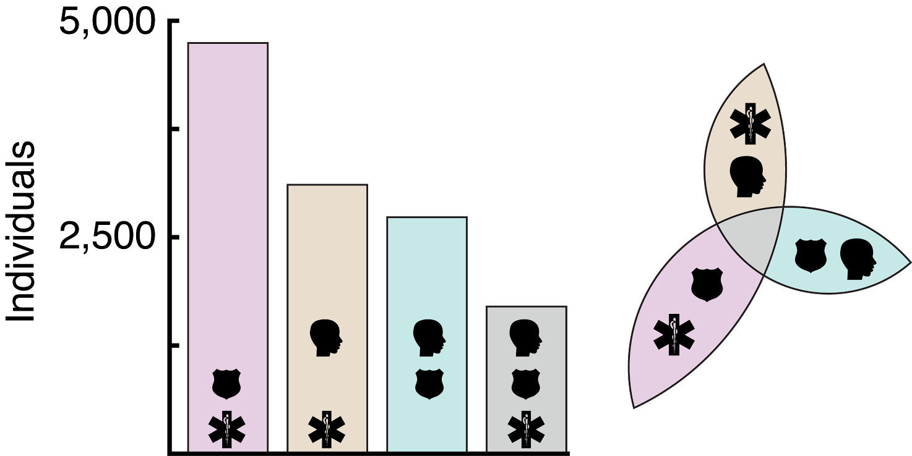

```


Team of researchers partnered with Johnson County, Kansas

--

- Goal of research is to develop an EIS to identify individuals who repeatedly cycle through multiple systems, including jails, EMS, mental health services.

--

- Output ('risk scores') directly affects policy and resource planning

--

- System needs to be reproducible not only for present but future data

--

- Lack of reproducibility / changes in risk scores could have negative consequences

--

Fully reproducible dnalysis pipeline on [GitHub](https://github.com/dssg/johnson-county-ddj-public).


---

class: center, middle

# Reproducibility is important for other stakeholders who use our work

---

# Important for the broader community


- Helps build trust and understanding in results


- Publishing code and data may not be enough 


- Consider other forms of reproducibility that promote usability


```{r, echo = F, out.width='500', fig.align='center'}

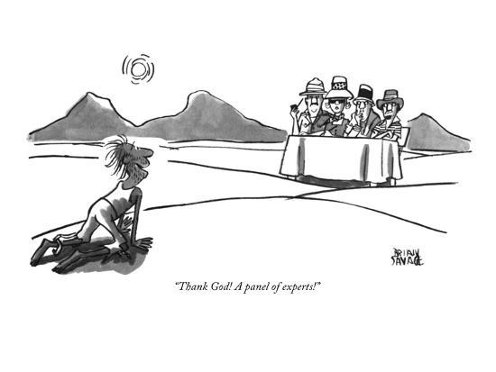

```

---


# Example: Family Planning Estimation Tool

```{r, echo = F, out.width='600', fig.align='center'}

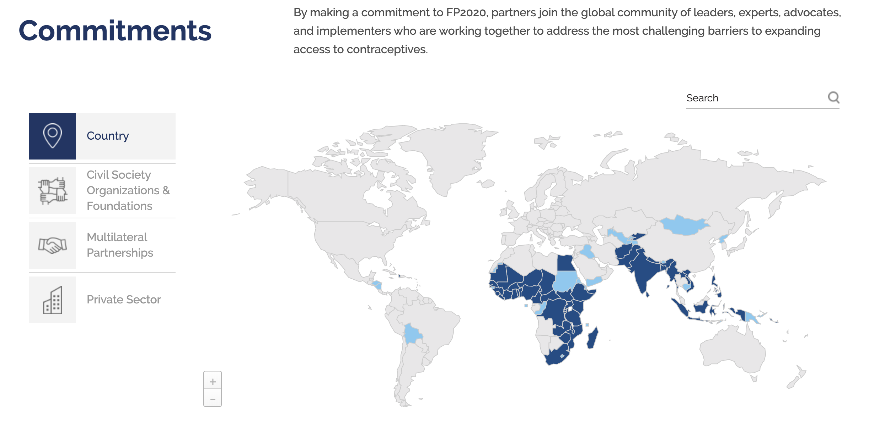

```


FP2020: adding an additional 120 million modern method users between 2012 and 2020 in the world’s 69 poorest countries. 

[Track20](http://www.track20.org/) works directly with governments in participating FP2020 countries to monitor progress in family planning and to actively use data to improve family planning strategies and plans.


---

# Tracking FP2020

- In order to track progress, we need estimates of modern contraceptive use. But this is challenging. 

--

- [Alkema et al. (2013)](https://www.ncbi.nlm.nih.gov/pubmed/23489750) uses complex statistical methods to combine and adjust multiple data sources of varying quality.

--

- Even if materials are fully reproducible, may be of limited use to those on the ground in the countries that are trying to achieve progress.

--

Family Planning Estimation Tool [(FPET)](https://fpet2019..org/#/) 

--

- R Shiny interactive application
- Allows country health and government officials to visualize results
- Rerun model to get estimates with new data


---
# FPET

```{r, echo = F, out.width='800', fig.align='center'}

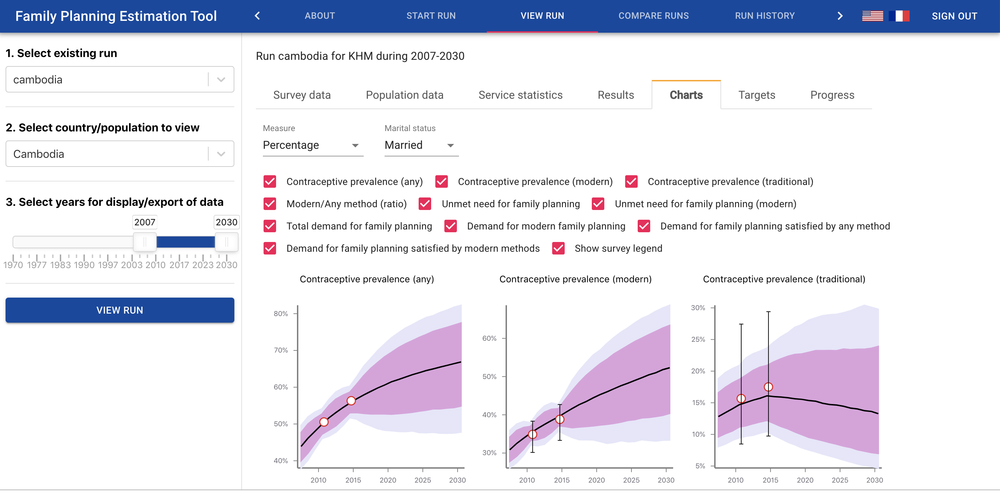

```


---


class: center, middle, inverse

# How do we do it?

---

# Motivating example: coding regions

Have a raw data set of studies by country. Want to create a new variable `region` that categorizes each country into their WHO region.

```{r, echo = F, out.width='800', fig.align='center'}

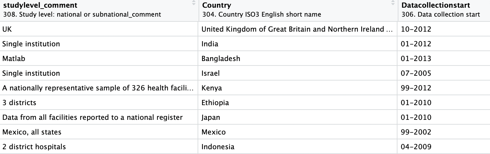

```

How would we do this?

---

# Coding regions

Method 1: 

- Google country/region correspondence
- Manual entry in Excel

--

```{r, echo = F, out.width='400', fig.align='center'}

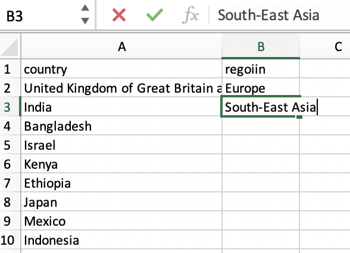

```


---

# Coding regions

Method 2: 

- Google country/region correspondence
- Manual entry in `R`

```{r, echo = F, message=FALSE}
library(tidyverse)
library(kableExtra)
library(here)
```

--

```{r, message = F}
d <- read_csv("data/countries.csv")
d %>% 
  mutate(region = 
           case_when(country=="United Kingdom of Great Britain and Northern Ireland"|country=="Israel" ~ "Europe",
                     country=="India"|country=="Bangladesh"|country=="Indonesia" ~ "South-East Asia",
                     country=="Kenya"|country=="Ethiopia" ~ "Africa",
                     country=="Japan" ~ "Western Pacific",
                     country=="Mexico" ~ "Americas",
                     TRUE ~ "NA"
  )) %>% 
  head(3) %>% kable() %>% kable_styling(font_size = 12)

```

---

# Coding regions
Method 3: 

- Manually download country/region correspondence from [WHO website](http://apps.who.int/gho/data/node.metadata.COUNTRY?lang=en)
- Save file in project folder (e.g. `data/info`)
- Read file into `R`
- Join to country list

--

```{r, message = F}
who_country_region <- read_csv("data/info/who_country_region.csv")
d %>% 
  left_join(who_country_region %>% 
              rename(country = DisplayString) %>% 
              select(country, WHO_REGION)) %>% 
  rename(region = WHO_REGION) %>% 
  head(3) %>% kable() %>% kable_styling(font_size = 12)
```


---

# Coding regions

Method 4: 

- Download country/region correspondence from [WHO website](http://apps.who.int/gho/data/node.metadata.COUNTRY?lang=en) in `R`
- Read file into `R`
- Join to country list

--

```{r, message=FALSE}
file_url <- "http://apps.who.int/gho/athena/data/xmart.csv?target=COUNTRY&profile=xmart"
utils::download.file(url = file_url,
                     destfile = "data/info/who_country_region.csv")
who_country_region <- read_csv("data/info/who_country_region.csv")
d %>% 
  left_join(who_country_region %>% 
              rename(country = DisplayString) %>% 
              select(country, WHO_REGION)) %>% 
  rename(region = WHO_REGION) %>% 
  head(3) %>% kable() %>% kable_styling(font_size = 12)
```


---

# Take-aways

- Not just one way of being reproducible

- Most appropriate methods/effort is context/skill dependent

```{r, echo = F, out.width='400', fig.align='center'}

knitr::include_graphics("fig/xkcd.png")

```


---


# Tools

No effort is too small!

--
.pull-left[
- Document, document, document!

- Well-commented code and details about assumptions goes a long way.

- Aim to keep detailed 'lab notes' ]

.pull-right[]
---

# Tools

### `R` Markdown

--

- 'dynamic' documents
- write text and embed your code (in chunks and also inline)
    + example: The square root of $\pi$ is `r round(sqrt(pi),2)`.
- removes disjoint between analysis and report writing
- render as pdf, html, word 
- these slides are an example!

```{r, echo = F, out.width='500', fig.align='center'}
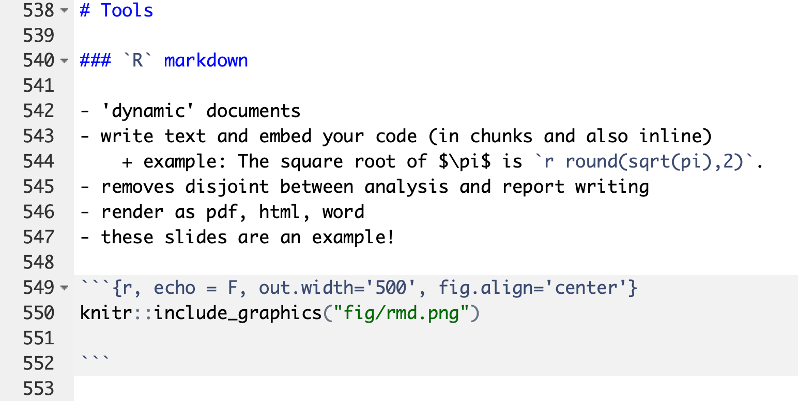

```


---

# Tools

### `R` packages

--

- Not just for CRAN
- Encourages well-documented code
- If you are writing modular code already, 90% of the way there
- Nice way of reading in functions you use all the time

---

# Tools

```{r, message=F, fig.width = 5, fig.height = 4, fig.align='center', dev='svg'}
#devtools::install_github("MJAlexander/distortr")
library(distortr)
ar_ts <- GetAR(nyears = 100, rho = 0.7, sigma = 0.1, seed = 1234)
ggplot(data = tibble(year = 2000+(1:100), y = ar_ts), aes(year, y)) + geom_point() + geom_line()

```


---

# Tools

### Other `R` tools

--

- `R` Shiny

    + Interactive web-based applications to visualize results
    + Lots of good examples and tutorials: https://shiny.rstudio.com/
    + [Opioid example](https://sanjaybasu.shinyapps.io/opioid_geographic/)

--

- RStudio Cloud
    
    + Run RStudio through web browser
    + Link to GitHub
    + Useful for teaching [(demography example)](https://rstudio.cloud/project/167428)

---

# Tools

### GitHub

--

- git is a version control system (think a more complicated Dropbox)

- Designed for software engineers, but useful for all sorts of code

- Useful for both collaborative and solo projects

- GitHub is useful place to host open source projects

```{r, echo = F, out.width='800', fig.align='center'}


```


--

You will be learning about some of these tools tomorrow!
---


class: center, middle, inverse


# Reproducibility across the whole data and analysis pipeline

---

# Data and analysis pipeline

```{r, echo = F, out.width='800', fig.align='center'}

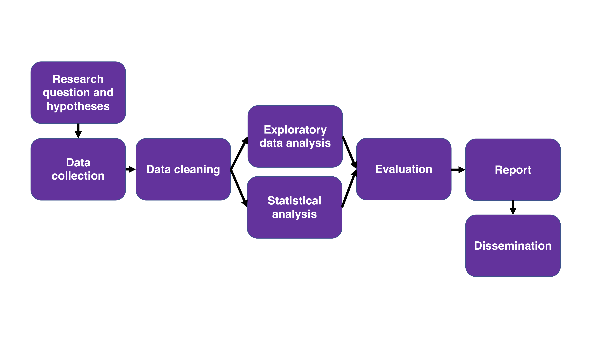

```

---

# Data and analysis pipeline

```{r, echo = F, out.width='800', fig.align='center'}

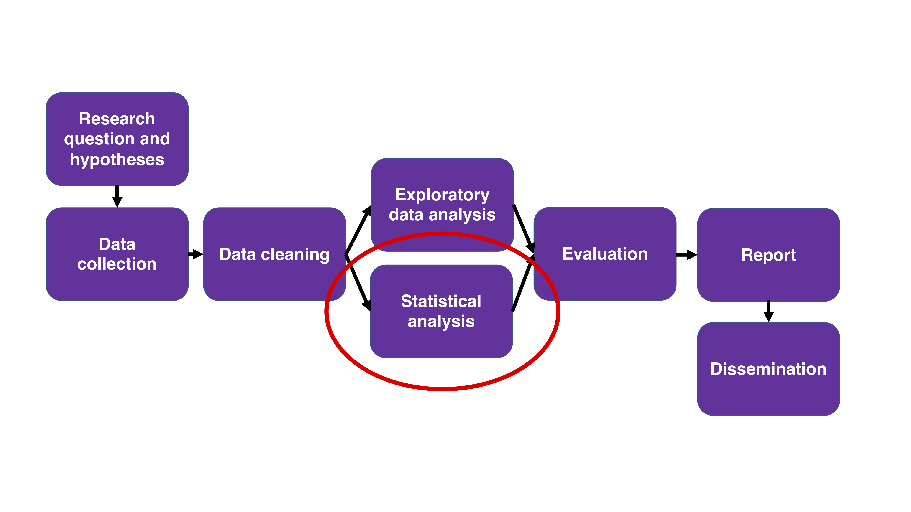

```

---

# Data and analysis pipeline

```{r, echo = F, out.width='800', fig.align='center'}

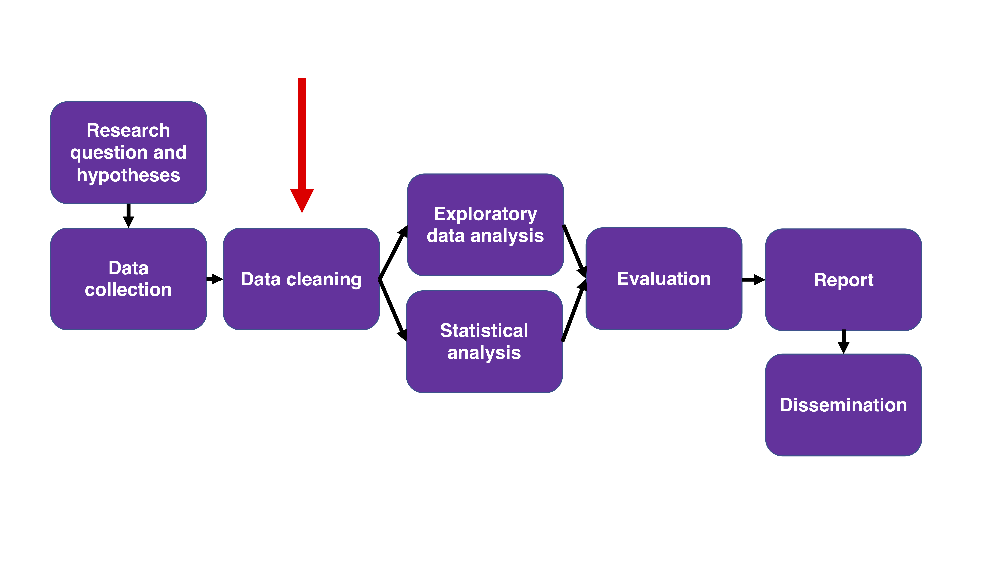

```

---

# Cleaning raw data

- Very important reproducible step

- Often neglected, but often contains the steps that are hardest to generalize

- Working with text data can be particularly messy. 

```{r, echo=FALSE}
library(stringr)
```

```{r}
text <- "THIS is        SomE text8 to be clean6ed."

text %>% 
  str_squish() %>% # removes excess white space
  str_to_lower() %>% 
  str_remove_all("[0-9]")
  
  
```


---

# Data and analysis pipeline

```{r, echo = F, out.width='800', fig.align='center'}

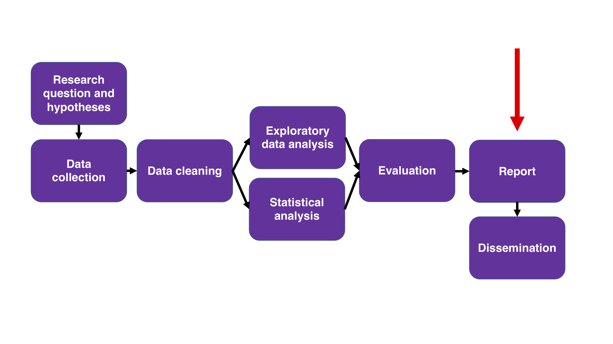

```

---

# Auto-generating reports

- Need to be able to match the numbers in the report to the numbers produced by the code!

- Easy to get lost with different versions / models / cut-offs, especially working towards a tight deadline

- R Markdown is one way to deal with this

- If working with external stakeholders: create a R markdown file that takes the (final) output of your model, and formats this in the way you want to report / other stakeholders want to see. 

```yaml
title: "A very important set of tables"
author: "Monica Alexander"
date: "10/8/2019"
output: word_document
```

---

class: center, middle, inverse

# Challenges and open questions

---

# What do we do when the data are confidential?

--

- Ideally we would have access to the complete raw data set that was used in analysis

--

- Sometimes this is not possible
    + Restricted access files (e.g. micro-level mortality data)
    + Completely confidential data (e.g. Chetty et al.'s access to IRS tax records)
    + Ethical concerns
    
--

What to do here?

--

- Simulation is one option to help improve reproducibility
    + Create a fake dataset that has the same format to your real data
    + That way, your code can still be run on something
    + There are `R` packages to help with this (`simPop`)
---

# How to we better value reproducibility?

--

- There are reasons not to be reproducible and open

--

- Currently limited incentives

---

- How do we break the life-cycle whereby reproducibility is something we can really only afford to do post-tenure?

--

.pull-left[
```{r, echo = F, out.width='800', fig.align='center'}


```
]

.pull-right[
```{r, echo = F, out.width='800', fig.align='center'}

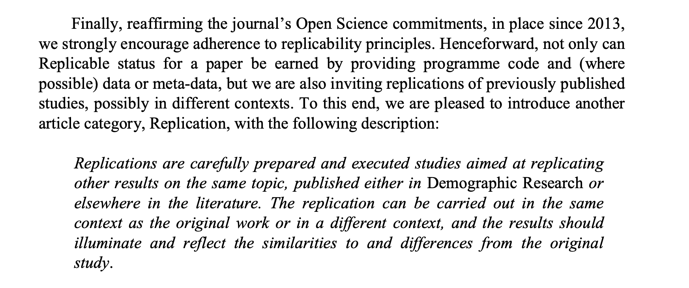

```
]

---

# Reproducible for whom?

```{r, echo = F, out.width='500', fig.align='center'}


```

--

- Who should be able to reproduce our results?

--

- How to we move beyond 'code and materials available on GitHub'?

---


# Summary

--

- Reproducibility is not just publishing your code

    + Data cleaning!
    + Reproducible reports

--

- Anything is better than nothing

    + Partial reproducibility is still good!
    + Aim to get better with each new project

--

- Be the change you want to see in the world

    + Work together with collaborators to improve workflow 
    + Community groups / discussions with non-academics


---

class: inverse, middle

# Thanks!

<a href="mailto:monica.alexander@utoronto.ca"><i class="fa fa-paper-plane fa-fw"></i>&nbsp; monica.alexander@utoronto.ca</a><br>
<a href="monicaalexander.com"><i class="fa fa-link fa-fw"></i>&nbsp; monicaalexander.com</a><br>
<a href="http://twitter.com/monjalexander"><i class="fa fa-twitter fa-fw"></i>&nbsp; @monjalexander</a><br>
<a href="http://github.com/MJAlexander"><i class="fa fa-github fa-fw"></i>&nbsp; @MJAlexander</a><br>

Slides are fully reproducible 😀: https://github.com/MJAlexander/reproducibility-in-demography
